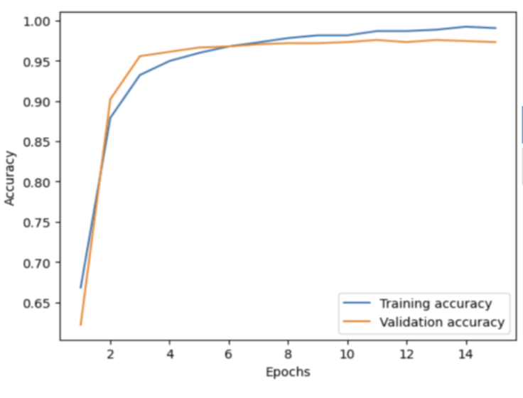

# Trees

Team Trees utilizes a convolutional neural network to classify trees at six different agro-forestry sites in Ecuador. This project is part of [The Erdos Institute's May 2023 Data Science Bootcamp](https://www.erdosinstitute.org/). 

### Team Members
[Michael Cerchia](https://www.linkedin.com/in/michael-cerchia-57a4b062/),
[Irit Huq-Kuruvilla](https://www.linkedin.com/in/irit-huq-kuruvilla-944a36179/),
[Margaux Joe](https://www.linkedin.com/in/margaux-joe),
[Dounia Lazreq](https://www.linkedin.com/in/dounia-lazreq/),
[Payel Mukhopadhyay](https://www.linkedin.com/in/payel-mukhopadhyay-5529b026b/),
[Carissa Moore](https://www.linkedin.com/in/carissa-moore-b579a8194/)

## Introduction
Over the past few decades, the amount of carbon dioxide has increased in the atmosphere. Carbon dioxide is the major greenhouse gas contributing to climate change. Because of the vital role that plants play in the carbon cycle, forests can act as a sink to sequester carbon from the atmosphere and store it in trees. However, due mainly to anthropogenic activities, much of the world's forest coverage has been lost. Over the past few decades, though, several conservation efforts have been undertaken to restore what has been lost and to aid in mitigation of climate change. Therefore, monitoring, verifying, and reporting of carbon offsets are crucial for accountability and transparency. To estimate these carbon offsets, machine learning models have been used, however, they often overpredict the carbon stock. The goal of this project is to explore the potential of tree species classification and carbon stock estimation using a state-of-the-art dataset, ReforesTree, that combines hand-measured field data and low-cost drone imagery of agro-forestry sites in Ecuador. 

## Original Data
The original ReforesTree dataset can be downloaded from [Zenodo](https://zenodo.org/record/6813783). Six agro-forestry sites in Ecuador were used to collect the data. This data includes raw drone RGB images, hand measured field data (tree species, diameter, biomass, etc.), a set of bounding boxes of trees for each site, and mappings of these bounding boxes with GPS locations. 

## Methodology
Two models were developed to explore tree species classification: a binary classification model and a multi-class classification model. The binary classification model classified trees between banana and not banana. The multiclass classification model classified trees as either banana, cacao, or other. A separate model was developed to estimate the above-ground biomass (AGB) for the sites. AGB is used as a proxy to predict the estimated carbon offset. For all three models, the data was split into 80% training and 20% test. For the training set, 20% of the data was extracted and used as a validation set. The images were run through a convolutional neural network (CNN), specifically ResNet 18. Both a simple CNN and EfficientNetB0 were also used, however, it was found that ResNet18 performed slighlty better. The network ran for 15 epochs and was validated against a precision and recall score. Both a precision and recall score were used since the model needs to be able to accurately and repeatedly identify the tree species. 

## Results
The model was very good at binary classification, meaning that the model was very good at identifying a banana tree. This can be seen in the chart below. The precision and recall score for this model was 97% and 95%, respectively. 

However, the model did not perform well for multi-class classification. The heat map below suggests that banana tree identification is still good, but when identifying cacao and other species, it does not perform at the same caliber.  

The model learns the AGB estimates of the training set well, but it fails to generalize as well on the validation and test sets. Compared to other models, it does not vastly overestimate carbon stock, which is a consequence of only learning from the drone data. This suggests that hand-measured field data is needed for any predicitions on carbon offsets.

There were a couple of challenges associated with this data. Primarily, there was a lot of GPS noise in the data that led to data pre-processing issues. As alluded to earlier, drone imagery and deep learning without hand collected field data may not provide meaningful predictions of the carbon stock. Therefore future work should include more complex data cleaning and pre-processing, improvements in CNN modeling, and updates for drone imagery and field data. 

## Acknowledgements
Reiersen, G., Dao, D., Lütjens, B., Klemmer, K., Amara, K., Steinegger, A., Zhang, C., & Zhu, X. (2022). ReforesTree: A Dataset for Estimating Tropical Forest Carbon Stock with Deep Learning and Aerial Imagery. Proceedings of the AAAI Conference on Artificial Intelligence, 36(11), 12119-12125. https://doi.org/10.1609/aaai.v36i11.21471

